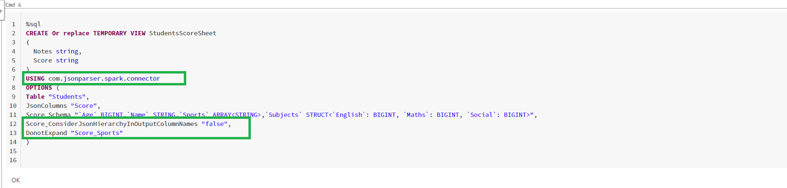
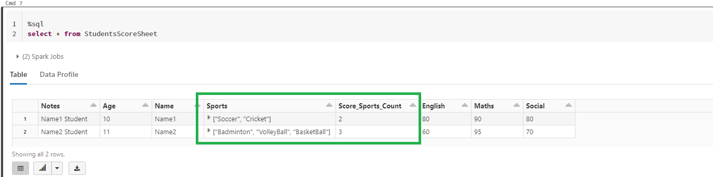
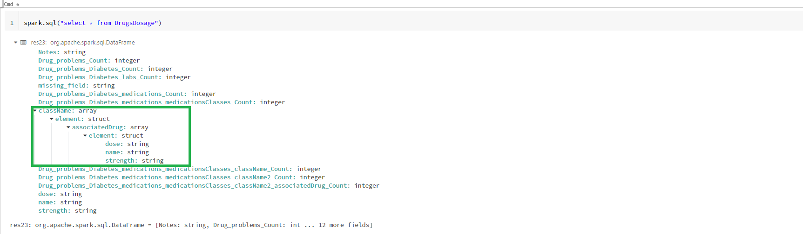

# Spark Json Parser Connector

There are various Apache spark connectors already available (Ex:- [sql-spark-connector](https://github.com/microsoft/sql-spark-connector)). Spark connectors help to connect to respective data sources either to read/query data and write data. 


Since [Apache Spark](https://spark.apache.org/) is distributed processing system and if the data sources have a well defined partitioning strategy, we ca build spark connectors which can efficiently read and write data to data sources. 

We can build spark connectors which may not be available with Spark libraries.

There isn't connector available to parse json columns in dataframe as flattened. We are able to build a custom connector to parse json column in dataframe and flatten. 
Given a json column in dataframe, there are sql functions like explode. In cases when the json is huge due to collections or nested structures, it is hard to write queries to explode a specific section within the json and repeating for multiple parts within the json makes the query complex to read.


The connector expects to pass table name or location to create a dataframe. Each row in dataframe is expected to have one or more columns with json strings. Connector post parsing the json will flatten the json data in each row from input dataframe and generates the output dataframe.
Flattening the json column will lead to adding rows while dealing with collections in the json and adding columns while dealing with json properties.

**Note : We also had a custom [rest api connector](https://github.com/vinsri-dev/spark-restapi-connector) to GET/POST/PUT Json from/to Rest End Point.
While using GET and if you are fetching json string from Rest API, you can use this connector on top of the downloaded json column to parse and flatten.**

## Json Parser Connector Properties

Below table is listed of supported properties which can be sent to json parses connector. Some of the properties are mandatory and few have a default value if not specified.

|Option|Purpose|
|------|-------|
|Table|Table name which can be resolved to read all the data.|
|Location| If the data has to be read from file system but not table, need to specify the path|
|Path|If Location is specified, then need to specify format, if format other than 'Parquet'.|
|JsonColumns|Comma separated list of columns from source table or location which contain JSON strings to parse.
|[JsonColumnName]_Schema|Foreach Json column which needs to be parsed, needs a schema.  Ex:- If 'RestCall_Response_Schema' is specified with a valid schema, then json string under 'RestCall_Response' column from source table is parsed with the mentioned schema.|
|[JsonColumnName]_Alias|Foreach Json column which needs to be parsed, the output data frame will include a column with corresponding name specified as alias.  Ex:- If 'RestCall_Response_Alias' is specified as 'ABC', it means after parsing 'RestCall_Response' column from source table as json, the output columns which get added are prefixed with 'ABC'.|
|[JsonColumnName]_ConsiderJsonHierarchyInOutputColumnNames|Value is expected to be 'true' or 'false'. Default value is 'true'. If the value is 'true', Foreach Json column which needs to be parsed, the output data frame column names are auto generated considering the hierarchy of the property in json schema. If the value is 'false', Foreach Json column which needs to be parsed, the output data frame column names are auto generated considering the name of properties in json schema. If there are duplicate columns found then the json property hierarchy is considered as column name.|
|DonotExpand|Json Properties which are to be not expanded or exploded while generating output data frame, should be mentioned here. Ex:- If 'RestCall_Response_Orders_OrderLines' is mentioned, then it means that after parsing input column 'RestCall_Response' based on mentioned schema (RestCall_Response_Schema), don't consider expand or explode property -> Orders.OrderLines, other wise if not mentioned then each order line in the collection will be flattened as a row in output data frame or if the property is an object each property of the object will be added as column in output data frame|
|Exclude|Json Properties which are to be excluded while generating output data frame, should be mentioned here. Ex:- If 'RestCall_Response_Orders_Parties_Address' is mentioned, then it means that after parsing input column 'RestCall_Response' based on mentioned schema (RestCall_Response_Schema), don't consider property -> Orders.Parties.Address and thus will be excluded in output data frame|

# Basic Json Example

Test cases are written for basic json parsing, please follow [here](src/test/scala/com/jsonparser/spark/connector/BasicJsonTests.scala).


```
val simpleJson1 = """{
      |"Name":"Name1",
      |"Age":10,
      |"Subjects":{"English":80, "Maths":90, "Social":80},
      |"Sports":["Soccer","Cricket"]
      |}
      |""".stripMargin

val simpleJson2 = """{
      |"Name":"Name2",
      |"Age":11,
      |"Subjects":{"English":60, "Maths":95, "Social":70},
      |"Sports":["Badminton","VolleyBall","BasketBall"]
      |}
      |""".stripMargin

import spark.implicits._
var inputDF=Seq(
  ("Name1 Student",simpleJson1),
  ("Name2 Student",simpleJson2)
).toDF("Notes","Score")
inputDF.createOrReplaceTempView("Students")
```

## Expanding all Json Fields Not Consider Json Hierarchy in Output Column Names and not Expand Sports






# Complex Json Example

Below is the sample considered as an example. As you can notice it cover nested objects and nested collections.

```
{
"problems": [{
    "Diabetes":[{
        "medications":[{
            "medicationsClasses":[{
                "className":[{
                    "associatedDrug":[{
                        "name":"asprin",
                        "dose":"",
                        "strength":"500 mg"
                    },
                    {
                        "name":"somethingElse",
                        "dose":"",
                        "strength":"500 mg"
                    }]
                }],
                "className2":[{
                    "associatedDrug":[{
                        "name":"asprin2",
                        "dose":"",
                        "strength":"500 mg"
                    },{
                        "name":"somethingElse",
                        "dose":"",
                        "strength":"500 mg"
                    }
                    ]
                }]
            }]
        }],
        "labs":[{
            "missing_field": "missing_value"
        }]
    }],
    "Asthma":[{}]
}]}
```

## Expanding all Json Fields and Consider Json Hierarchy in Output Column Names


## Expanding all Json Fields and not to Consider Json Hierarchy in Output Column Names


Hierarchy is considered if there are duplicate json properties in different levels.
Ex:- "dose" property exists in 2 different levels, such as
Drug_problems_Diabetes_medications_medicationsClasses_className_associatedDrug_dose,
Drug_problems_Diabetes_medications_medicationsClasses_className2_associatedDrug_dose. So "dose" column is added in output with respective hierarchies but "missing_field" is not found duplicate in different levels, so the output column "missing_field" is added without hierarchy.


## Expanding all Json Fields but not expanding a specific hierarchy

We have set to not expand json hierarchy -> "Drug_problems_Diabetes_medications_medicationsClasses_className"

Incase if you wish to handle json property at a specific hierarchy with your custom logic using spark sql functions, you can ask explicitly to not expand from that level.





## Expanding all Json Fields but excluding a specific hierarchy

We have set to exclude json hierarchy -> "Drug_problems_Diabetes_medications_medicationsClasses_className"

Incase if you want to skip json from specific level completely, you can either not mention in the schema property itself or you can mention the hierarchy explicitly to exclude.


